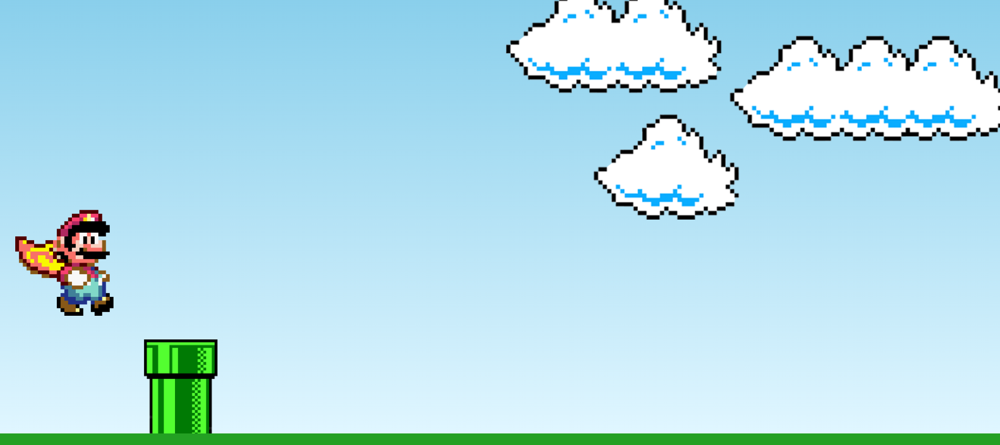

# Simple Super Mario Game
- [Link to website](https://sans-script.github.io/simple-mario-game/)
A simple Super Mario game created using HTML, CSS, and JavaScript.

Nintendo might be able to sue you for this lol.

## Table of Contents

- [Description](#description)
- [Preview](#preview)
- [How to Play](#how-to-play)

## Description

This project is a basic implementation of a Super Mario game using HTML, CSS, and JavaScript. It features Mario, pipes, clouds, and a continuous scrolling background. The game is designed to be a simple demonstration and can be enhanced with additional features.

## Preview

## How to Play

1. Open the `index.html` file in a web browser.
2. Mario will automatically start moving to the right.
3. Enjoy the background music and Mario's jump animation.
4. You can enhance the game by adding additional features, levels, or interactions.
